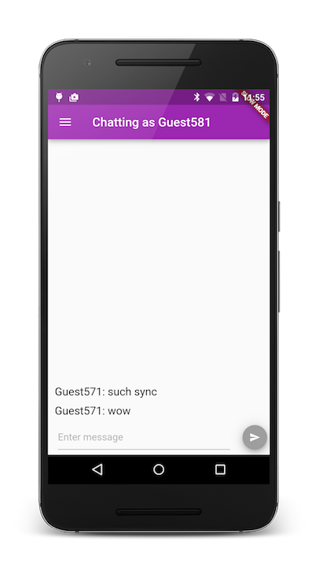
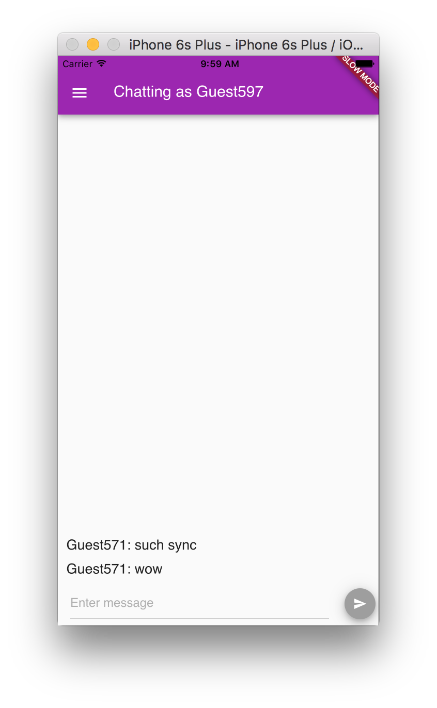

# firechat_flutter

Firechat is a simple, extensible chat widget powered by [Firebase](https://www.firebase.com/?utm_source=firechat).
It is intended to serve as a concise, documented foundation for chat products built on Firebase.
It works out of the box, and is easily extended.

## Getting Started with Firebase

Firechat requires Firebase in order to store data. You can
[sign up here](https://www.firebase.com/signup/?utm_source=firechat) for a free account.

## Getting Started with Flutter

For help getting started with Flutter, view the [Flutter documentation](http://flutter.io/).

## Building for Android

In the firechat-flutter directory, run ```pub get```.

    flutter apk

    adb install -r build/app.apk

    adb shell am start -n com.example.firechat_flutter/org.domokit.sky.shell.SkyActivity

You should see this on your device:



## Building for iOS

We are currently adding support for third-party iOS services to the ```flutter``` tool. In the meantime, you'll need a custom compiled Flutter engine with Firebase enabled to use Firebase on iOS. Start with the latest master of http://github.com/flutter/engine and cherry-pick 7df7ff152d70735426a5e30d5c9b3afa73503839 from http://github.com/collinjackson/flutter_engine to add Firebase to your shell.

After building your engine with ninja, open the Harness project by running

    open out/ios_sim_Debug/Flutter/FlutterApplication.xcodeproj/
    
Edit your Local.xcconfig:

    FLUTTER_APPLICATION_PATH=/path/to/firechat-flutter
    
Then hit play. It should look like this:


